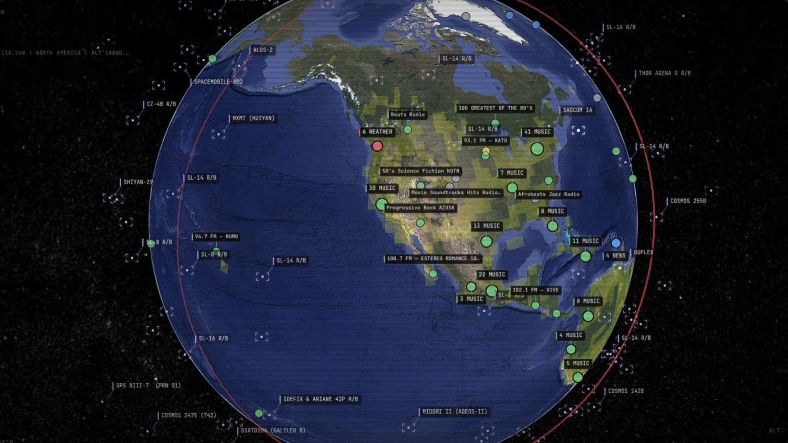
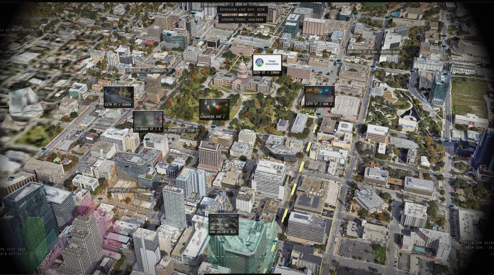
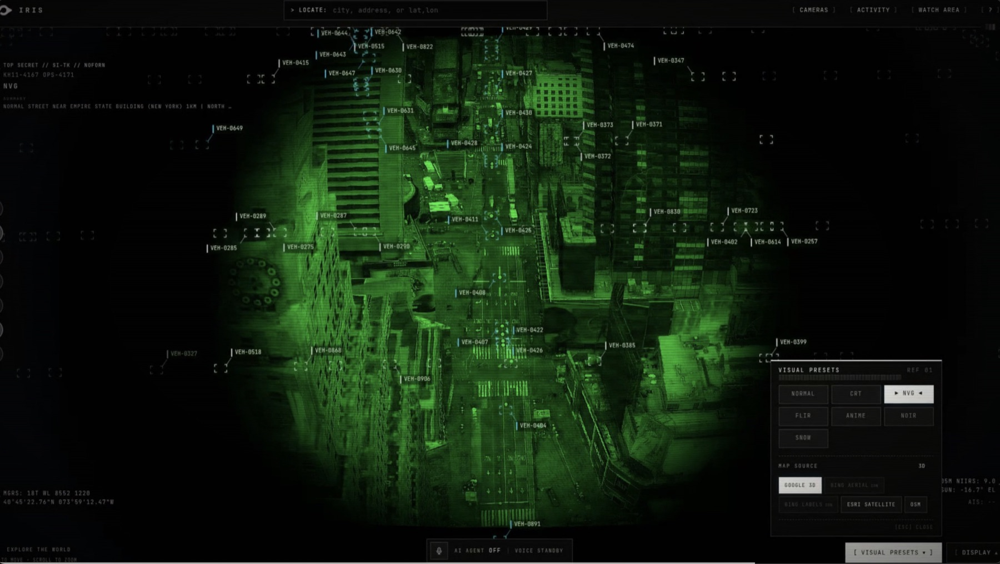

# Iris

Iris spots smoke and fire on public cameras and texts the people nearby. A
detection worker watches camera feeds with Gemini vision and records confirmed
incidents in SpacetimeDB. The alerts service matches each confirmed incident to
people whose shared location (or watched place) is in range, and sends them an
iMessage through Photon Spectrum. People can then text back for follow-ups,
help, and shelters. The web app is a 3D globe of cameras and incidents, and an
iPhone companion app keeps a person's location current.



```text
cameras ──▶ services/cv ──▶ SpacetimeDB ◀── services/photon ◀──▶ iMessage (Spectrum)
            (detect smoke,   (cameras,           (commands, location,
             confirm          incidents,          help agent, phone
             incidents)       alerts, profiles)   enrollment)
                                  │   ▲
                                  ▼   │
                             services/alerts ──▶ iMessage alert to people in range
                                  ▲
           apps/web (globe) ──────┘ reads live state    apps/ios keeps location fresh
```

## Local setup

Install Node.js and npm, then run from the repository root:

```sh
npm install
cp .env.example .env
```

Fill in `.env` as integrations become available. Keep credentials in `.env`,
which is ignored by Git; `.env.example` contains placeholders and describes
every variable.

## Repository layout

| Folder | Contents |
| --- | --- |
| `apps/web/` | Web globe, built on the vendored [Iris](apps/web/reference/) console |
| `apps/ios/` | Sauron iPhone location companion app |
| `services/cv/` | Smoke detection worker: frame sources, Gemini detector, incident lifecycle |
| `services/alerts/` | Matches confirmed incidents to people and sends alerts |
| `services/photon/` | Spectrum webhook, iMessage commands, help agent, phone enrollment |
| `services/evac/` | Evacuation-assist agent (local demo, not deployed) |
| `spacetimedb/` | SpacetimeDB module and schema ([guide](spacetimedb/README.md)) |
| `packages/shared/` | Shared contracts, database adapter, geo and text helpers |
| `packages/db-generated/` | Generated SpacetimeDB bindings |
| `packages/messaging/` | Spectrum iMessage sending helpers |
| `scripts/` | Demo seeding/reset tooling and integration tests |

## Commands

Run commands from the repository root:

```sh
npm run dev:web            # web globe (Vite)
npm run dev:photon         # Spectrum webhook + iMessage commands
npm run dev:alerts         # incident → alert matching and delivery
npm run dev:cv             # smoke detection worker
npm run dev:evac           # evacuation-assist demo
npm run demo:start         # prints the demo startup steps
npm run demo:reset         # deactivate watches, close open incidents
npm test                   # typecheck plus all unit tests
```

## Running the backend

The backend is four long-running processes plus a public HTTPS tunnel to
Photon:

| Process | Command | Port / role |
| --- | --- | --- |
| SpacetimeDB (local) | `spacetime start --listen-addr 127.0.0.1:3000` | `3000` — database |
| Photon | `npm run dev:photon` | `PHOTON_PORT` (default `3001`) — Spectrum webhook + commands |
| Alerts | `npm run dev:alerts` | no HTTP port — watches DB and sends proactive iMessages |
| Detection | `npm run dev:cv` | no HTTP port — samples cameras and confirms incidents |
| ngrok | `ngrok http 3001` | public HTTPS → Photon |

Use one terminal per process from the repo root (skip the local SpacetimeDB
terminal if you point `.env` at a hosted maincloud database).

### 1. Configure `.env`

```sh
cp .env.example .env
```

Minimum for local backend + iMessage:

```sh
SPECTRUM_PROJECT_ID=
SPECTRUM_PROJECT_SECRET=
SPECTRUM_WEBHOOK_SECRET=   # optional, defaults to the project secret
SPACETIMEDB_URI=http://127.0.0.1:3000
SPACETIMEDB_DATABASE=tempmhacks-local
VITE_SPACETIMEDB_URI=http://127.0.0.1:3000
VITE_SPACETIMEDB_DATABASE=tempmhacks-local
WATCH_RADIUS_KM=10
PUBLIC_APP_URL=https://your-public-web-app.example
GEOCODER_USER_AGENT=Downwind/0.1 (contact: you@example.com)
PHOTON_PORT=3001
GEMINI_API_KEY=            # smoke detection; also enables the help agent
```

For hosted SpacetimeDB, set `SPACETIMEDB_URI`, `SPACETIMEDB_DATABASE`, and
`SPACETIMEDB_TOKEN` instead of the local URI. Legacy `PHOTON_PROJECT_ID` /
`PHOTON_SECRET` aliases are also accepted.

### 2. Start SpacetimeDB and publish the module

Install the [SpacetimeDB CLI](https://spacetimedb.com/install) **2.10.2**, then:

```sh
# terminal A — local DB only
spacetime start --listen-addr 127.0.0.1:3000
```

```sh
# terminal B — once per schema change
npm run db:publish          # local
# or
npm run db:publish:maincloud # hosted (after: spacetime login --token "$SPACETIMEDB_TOKEN")
```

Seed demo data when needed:

```sh
npm run demo:seed:cameras       # local CLI
npm run demo:seed:cameras:sdk   # hosted / SDK path
```

### 3. Start Photon, alerts, and detection

```sh
# terminal B
npm run dev:photon
```

```sh
# terminal C
npm run dev:alerts
```

```sh
# terminal D
npm run dev:cv
```

Photon should log that it is listening on `/spectrum/webhook`. Alerts has no
HTTP listener; it subscribes to SpacetimeDB and sends iMessages when confirmed
incidents match active watches / location profiles. Detection has no HTTP
listener either; it samples every registered camera and confirms incidents (see
[Smoke detection](#smoke-detection)).

### 4. Expose Photon with ngrok

Photon must be reachable on public HTTPS so Spectrum can POST webhooks.

1. Install the [ngrok agent](https://ngrok.com/download) and authenticate once
   (`ngrok config add-authtoken <token>` from the ngrok dashboard).
2. In another terminal, forward Photon:

```sh
# ephemeral URL (changes every restart)
ngrok http 3001
```

If you have a reserved free domain:

```sh
ngrok http --url=<your-subdomain>.ngrok-free.dev 3001
```

Use the same port as `PHOTON_PORT` (default `3001`).

3. Copy the `https://…` forwarding URL from the ngrok UI (or
   `http://127.0.0.1:4040`).
4. In the Photon / Spectrum dashboard, set the webhook to:

```text
https://<your-ngrok-host>/spectrum/webhook
```

5. Set the dashboard signing secret if you override it. Photon defaults
   `SPECTRUM_WEBHOOK_SECRET` to the project secret when unset. Restart
   `npm run dev:photon` after any secret change.

Notes:

- Free ngrok may show an interstitial browser page; Spectrum webhooks are server
  POSTs and normally bypass that. If verification fails, confirm the path is
  exactly `/spectrum/webhook` and the signing secret matches.
- Restarting ngrok without a reserved domain changes the public URL — update
  the Photon dashboard each time.
- Local inspector: `http://127.0.0.1:4040` shows request/response history.
- `cloudflared tunnel --url http://localhost:3001` works as an alternative if
  you prefer Cloudflare over ngrok.

### 5. Smoke-test

```sh
npm run photon:send-test -- +15551234567
```

Then text the project line `HELP`, share a location from Apple Maps, or
`WATCH Ann Arbor`. With the replay fixture downloaded, `dev:cv` confirms an
incident on the Ann Arbor demo camera within a minute; `npm run demo:seed:incident`
seeds one directly. Reset between runs with
`npm run demo:reset`.

## Smoke detection

`services/cv` turns camera frames into incidents. For every registered camera
it samples a frame, asks Gemini whether it shows smoke from something burning or
open flames, and drives that camera's incident through its lifecycle:

| Step | Rule (defaults) |
| --- | --- |
| Sighting | A frame scoring ≥ 0.5 opens a `candidate` incident and is published as an observation (with a normalized 0–1 bounding box when Gemini localizes the plume). |
| Confirm | ≥ 3 sightings among the candidate's last 5 frames, at least one ≥ 0.7. Confirmation is what triggers alerts. |
| Dismiss | 4 misses in a row while still a candidate. |
| Resolve | A confirmed incident with no sighting for 15 minutes. |

Each camera has at most one open incident, and the worker resumes it from the
database after a restart. A failed Gemini call skips the frame instead of
counting as a miss. A source that fails (for example a webcam returning HTTP
errors) marks the camera `offline` and is retried every 30 seconds; the replay
video loops. The prompt excludes clouds, fog, dust, haze and white steam plumes
with no fire beneath them.

Detection and alerting are connected only through SpacetimeDB: the alerts
service subscribes to incidents, so anything that confirms one (the detector or
`npm run demo:seed:incident`) reaches people the same way.

| Variable | Default | Purpose |
| --- | --- | --- |
| `GEMINI_API_KEY` | — | Required |
| `CV_MODEL` | `gemini-flash-latest` | Vision model |
| `CV_INTERVAL_MS` | `30000` | Frame interval for live webcams |
| `CV_REPLAY_INTERVAL_MS` | `3000` | Frame interval for the demo replay video |
| `CV_CAMERA_IDS` | all | Comma-separated cameras to watch |

Every sampled frame is one Gemini call: about 2,900 calls a day per live camera
at the default interval. Replay cameras are skipped when their video file is
missing (`npm run demo:download-fixture` fetches it), so a hosted worker only
watches live cameras.

```sh
npm run dev:cv
SPACETIMEDB_URI=http://127.0.0.1:3000 SPACETIMEDB_DATABASE=tempmhacks-local npm run test:detection-e2e
```

`test:detection-e2e` checks the whole chain against a local module, from frames
to a delivered alert, with a scripted detector and a recording messenger, so it
needs no Gemini or Spectrum credentials.

## Photon iMessage and alerts

The Photon service uses Spectrum's managed iMessage provider only. It accepts
native Spectrum webhooks at `POST /spectrum/webhook`, passes the exact request
bytes to Spectrum for HMAC verification, durably claims each Photon message ID,
and then runs the deterministic command router. The SDK acknowledges webhooks
before the command callback runs.

Supported iMessage commands are `STATUS`, `HELP`, `STOP`, `WATCH <place>`, and
`WATCH ME` / `PAIR` (live location from the iPhone app),
plus sharing a location from Apple Maps and natural follow-up questions after an
alert. The alert service matches confirmed incidents to fresh location profiles
and active watches with Haversine distance, claims each pending alert before
sending, and records either the Spectrum message ID or a terminal failure. Replies
longer than ~200 characters are split at paragraph breaks into a few messages.

### Sharing a location (Apple Maps)

The supported way to share location is native and needs no setup: in Apple Maps,
tap the blue location dot, then **Share → Messages**, and send it to the line.
The share arrives as a `maps.apple.com/place?...&coordinate=<lat>,<lng>` link,
which Photon parses into a `UserAlertProfile`. Links named "My Location" are
treated as the user's current location; other places are saved as the place
shared. `LOC <lat>,<lng>` remains as a typed fallback for testing.

Every reply states whether a location was received. Find My "Share My Location",
Maps app-extension balloons, and Google Maps short links carry no readable
coordinates; when one arrives, the agent says no location was received and
explains how to share from Apple Maps instead.

A share is a one-time snapshot, not continuous tracking. After the default
30-minute freshness window, distance phrasing downgrades to "near your last
shared location," `STATUS` reports how old the location is, and the agent asks
the user to share again.

### Current-location monitoring (primary surface)

A shared location upserts one `UserAlertProfile` per sender with the point, a
`locationUpdatedAt` freshness anchor, a radius, and `alertsEnabled`. Alerts are
always on while the agent has a location; there is no pause toggle (`ALERTS ...`
replies that alerts stay on). `STOP` is the only opt-out: it deactivates watches,
disables the profile, and clears the conversation's incident anchor. The next
location share re-enrolls the user cleanly.

Proximity matching is deterministic. A confirmed incident alerts a profile only
when the profile is enabled, its location is fresh (30-minute window), and the
incident is within its radius. One alert per incident/profile is enforced, with
no duplicates on retry. `WATCH <place>` remains a secondary, place-based fallback.

### Live location from the Sauron iPhone app

`apps/ios/` is a small SwiftUI app whose only job is keeping the user's
location-backed profile current. It doesn't do chat, maps, or alerts. Matching
and delivery stay in the alerts service, and `STATUS`, `STOP`, `HELP`, and
conversation stay in Photon.

Flow:

1. The user texts `WATCH ME`. Photon replies with a single-use link,
   `<MOBILE_PAIRING_BASE_URL>/pair/<token>`, that expires after 10 minutes. The
   token resolves server-side to the sender's `spaceId`/`senderId`, so the user
   never types an identifier.
2. The link page opens `sauron://pair?token=…&api=<server>`. The user taps
   **Pair This iPhone**, and the app redeems the token at `POST /api/mobile/pair`.
   It gets back a device token (`<deviceId>.<secret>`) and stores it in the
   Keychain (this device only, readable after first unlock).
3. The app requests When In Use access, then Always. It uses Core Location at
   ~100 m accuracy with a 250 m distance filter and automatic pausing, plus
   significant-change monitoring, which relaunches the app after it is
   terminated. It uploads (`POST /api/mobile/location`, bearer token) only when
   the user has moved ≥1 km from the last upload, or after 15 minutes without an
   upload while moving. Fixes worse than 500 m are dropped.
4. Each accepted upload moves the user's one `UserAlertProfile` in place. No
   watches are created. A profile kept current by the app counts as fresh for
   6 hours instead of 30 minutes, because a phone that isn't moving doesn't
   upload.
5. `STOP` disables the profile and the device's tracking at once; later uploads
   get `403 tracking_stopped`. `WATCH ME` reuses the existing pairing (no new
   setup), and `PAIR` issues a fresh link for a new phone, which replaces the
   old device.

The backend stores only SHA-256 hashes of pairing and device tokens, in private
tables (`mobile_pairing`, `mobile_credential`). `mobile_device` is public and
holds no credentials. The app contains no Spectrum, SpacetimeDB, or Photon
secrets. To revoke a device:

```sh
curl -X POST "$MOBILE_PAIRING_BASE_URL/admin/mobile/revoke" \
  -H "Authorization: Bearer $PHOTON_ADMIN_SECRET" -H 'content-type: application/json' \
  -d '{"deviceId":"<deviceId>"}'
```

Setup: set `MOBILE_PAIRING_BASE_URL` to Photon's public HTTPS URL (the same
ngrok URL as the webhook) and republish the module (`npm run db:publish`). Then
open `apps/ios/SauronLocation.xcodeproj` in Xcode 26, select your team, and run
on an iPhone. Without a team the app still builds and runs on the simulator.
Pairing uses the `sauron://` scheme, so no Associated Domains entitlement is
required. For universal links, set `APPLE_TEAM_ID` (Photon then serves
`/.well-known/apple-app-site-association`) and add the
`applinks:<host>` entitlement.

Tests:

```sh
npm run test:ios                      # unit tests on the simulator (IOS_SIMULATOR, default "iPhone 17")
npm run test:mobile-e2e               # backend flow against a published local module
npm run test:ios-e2e                  # drives the real app on a simulator against a local module
```

Both e2e scripts read `SPACETIMEDB_URI`/`SPACETIMEDB_DATABASE`, refuse
non-local servers, and leave uniquely named rows behind. `test:ios-e2e`
reinstalls the app, resets its location permission, accepts the real prompts,
and checks that a 450 m move doesn't upload, while >1 km moves do, both in the
foreground and in the background, and after a relaunch.

Limitation: iOS delivers no location while the phone is stationary, so a phone
that stays put for more than 6 hours ages out of matching until it moves or the
app is opened. Opening the app refreshes the location.

### Grounded conversational follow-ups

When an alert is delivered, the alert service anchors that conversation to the
incident (a `ConversationContext` row keyed by space). The user can then ask
natural follow-ups — "what happened?", "where is it?", "how far is it from me?",
"is it still active?", "when was it first seen?", "which camera?", "show me",
"any other cameras?" — without restating an incident ID. Intents are classified
by keyword and answered only from structured database state (Incident +
Observation + Camera + the user's profile). The model is never the source of
truth: it does not invent incident type, location, distance, time, severity, or
any safety advice. "Show me" sends the latest camera evidence frame as an
attachment plus the live web link; the web app remains the deeper inspection
layer.

Set `PUBLIC_APP_URL` for the Photon service as well (used to build incident deep
links in grounded answers).

### Help agent (optional, Gemini)

With `GEMINI_API_KEY` set, Photon also answers texts that no command or grounded
follow-up covers ("my power's out and my mom needs oxygen", "where's the nearest
urgent care?", "we need to leave, 3 of us and a dog"). A Gemini agent replies in
short texts and uses tools for every fact: the person's situation (location and
nearby confirmed incidents), ranked shelters with routes that avoid incident
areas, driving directions, and nearby places from OpenStreetMap. It never invents
addresses or numbers beyond 911, 211, 988 and Poison Control, and puts "call 911"
first when something sounds life-threatening. When an incident is newly
confirmed within `ASSIST_RADIUS_KM` (default 3 km) of someone, it sends one text
checking that they're safe and offering help.

Commands, location shares and grounded answers keep priority. Once someone is
talking with the agent, their other texts go to it until they send `STOP` or go
quiet for 6 hours. Conversations are held in memory. If the model errors or
declines, the person gets a fixed "call 911 / call 211" reply. Without the key,
Photon behaves exactly as described above. `GEMINI_MODEL` overrides the default
`gemini-flash-latest`; `ASSIST_DEMO_SHELTERS=0` drops the labeled Ann Arbor demo
shelters and keeps only live FEMA open shelters.

Alert links use `/incident/:incidentId`. The web app connects with the two
`VITE_SPACETIMEDB_*` values, selects and focuses that exact incident, retains
resolved incident details, and shows explicit not-found or retryable database
errors.

The default geocoder is the public OpenStreetMap Nominatim service. Queries are
end-user initiated, serialized to at most one request per second, and cached in
process. Provide an identifying `GEOCODER_USER_AGENT`, retain OpenStreetMap
attribution in product surfaces, and review the Nominatim usage policy before
deployment. `GEOCODER_BASE_URL` can switch to another compatible or self-hosted
endpoint without a code change. Geocoding data © OpenStreetMap contributors.

### Runbook: run the iMessage flow end to end

This is the verified path for bringing the inbound command flow and proactive
alerts online, including against a hosted SpacetimeDB (maincloud) database. For
the shorter day-to-day steps, see [Running the backend](#running-the-backend).

1. **Configure `.env`.** For a hosted database, set `SPACETIMEDB_URI`,
   `SPACETIMEDB_DATABASE`, and `SPACETIMEDB_TOKEN` (maincloud requires the
   token). Also set `SPECTRUM_PROJECT_ID`/`SPECTRUM_PROJECT_SECRET` (or the
   legacy `PHOTON_PROJECT_ID`/`PHOTON_SECRET`), `SPECTRUM_WEBHOOK_SECRET`,
   `GEOCODER_USER_AGENT`, and `PUBLIC_APP_URL`.

2. **Publish the module** so the deployed schema matches the code. Local:
   `npm run db:publish`. Hosted: log in once with
   `spacetime login --token "$SPACETIMEDB_TOKEN"`, then
   `npm run db:publish:maincloud` (reads `$SPACETIMEDB_DATABASE`). A schema
   change on an existing database may require `--delete-data`; see the migration
   note below.

3. **Seed the demo camera.** Hosted (no local CLI server needed):
   `npm run demo:seed:cameras:sdk`. Local CLI: `npm run demo:seed:cameras`.
   Both are idempotent and leave an existing camera unchanged.

4. **Start the services:** `npm run dev:photon` (webhook on `PHOTON_PORT`,
   default 3001), `npm run dev:alerts`, and `npm run dev:cv`.

5. **Expose the webhook with ngrok:**
   `ngrok http 3001` (or
   `ngrok http --url=<your-subdomain>.ngrok-free.dev 3001` with a reserved
   domain). Confirm forwarding in the ngrok UI or at `http://127.0.0.1:4040`.

6. **Point Photon at the tunnel.** In the Photon dashboard, set the webhook to
   `https://<ngrok-host>/spectrum/webhook`. Photon signs webhooks with the
   project secret, so `SPECTRUM_WEBHOOK_SECRET` is optional and defaults to it.
   Restart `dev:photon` after any secret change. Update the dashboard URL
   whenever an ephemeral ngrok host changes.

7. **Drive the flow.** From an added phone, text the project's line:
   `HELP`, `WATCH Ann Arbor`, `STATUS`, `STOP`. Then let detection confirm an
   incident on the replay camera, or seed one with
   `npm run demo:seed:incident`; the alert service matches it against active
   watches and location profiles and sends a proactive alert into the existing
   conversation.

8. **Reset between runs.** `npm run demo:reset` deactivates watches and moves
   incidents to terminal states (resolved/dismissed) while keeping cameras.

Diagnostics: `npm run photon:send-test -- +15551234567` opens a DM and sends one
message to confirm credentials. On a shared-pool (free) line, cold
outbound-first sends are rejected with `Target not allowed for this project`;
sending into a conversation the user started first is on the allowed path, which
is why alerts land once the user has texted the line.

Shared-tier notes: a shared line only replies to phones added to the project,
and new-conversation limits apply. A dedicated (Business) line removes the
outbound-first restriction. SpacetimeDB has no row-delete reducer here, so
`demo:reset` transitions rows to terminal states rather than deleting them; a
schema-incompatible republish to an existing database requires `--delete-data`,
which destroys all rows (re-seed the camera afterward with
`demo:seed:cameras:sdk`).

## Web globe

`apps/web` layers this project's live data onto
[Iris](apps/web/reference/), a vendored real-time 3D globe console (MIT,
© Bilawal Sidhu). `src/integration.ts` subscribes to SpacetimeDB and draws
cameras and incidents; alert links (`/incident/:incidentId`) select and focus
that incident, keep resolved incident details, and show explicit not-found or
retryable database errors. The globe can also enroll a phone for alerts at a
picked point through Photon. To report a dangerous event, select **Report event**,
click the map, set the zone and headline, then send. Photon confirms it, the
alerts worker texts enrolled people whose areas overlap it, and the iPhone app
shows it as a nearby danger. **Activity** lets an operator confirm, dismiss, or
resolve incidents; resolving a reported incident sends an all-clear to alerted
conversations. These actions require `VITE_PHOTON_URL` and the operator key
(`PHOTON_ADMIN_SECRET`), entered once per browser tab. Keep that key in Photon's
server environment, never in a `VITE_*` value. Photon's database identity also
needs a one-time `grant_operator` from the database owner for manual reports.



*Live camera frames pinned to their intersections over Google photorealistic 3D tiles.*



*The NVG visual preset with tracked vehicles. Presets (CRT, NVG, FLIR, anime, noir, snow) and map sources are under Visual Presets.*

```sh
npm run dev:web
npm run build:web
```

| Variable | Purpose |
| --- | --- |
| `VITE_SPACETIMEDB_URI`, `VITE_SPACETIMEDB_DATABASE` | Database the browser reads |
| `VITE_PHOTON_URL` | Photon base URL for enrollment and incident actions |
| `VITE_CESIUM_ION_TOKEN`, `VITE_GOOGLE_MAPS_API_KEY` | Optional; OpenStreetMap imagery is used without them |

`VITE_` values are compiled into public JavaScript, so never put secrets in
them. Iris layers that depend on its Vite dev-server providers (aircraft, CCTV,
fires and similar live feeds) work under `dev:web` but not in a static build.
The build imports `apps/web/reference/build/`, which must stay committed.

## Demo cameras and replay fixture

The deterministic replay camera is `demo-camera-001` at `42.2808, -83.7430`.
Its sample is an 11-second, public-domain USGS video of lava falls and a steam
cloud. Downloading is explicit so a missing fixture never prevents installing,
building, or seeding the project:

```sh
npm run demo:download-fixture
npm run demo:seed:cameras
```

The optional live source is the USGS Hawaiian Volcano Observatory K2 camera at
Uēkahuna bluff (`19.4202, -155.2881`). Its current JPEG is public domain and the
camera can be unavailable because of darkness, weather, maintenance, or volcanic
conditions. Register both the replay and live camera in one idempotent command:

```sh
ENABLE_LIVE_CAMERA=1 npm run demo:seed:cameras
```

The seed command treats an existing camera ID as success and leaves that row
unchanged. It uses `SPACETIME_BIN`, `SPACETIMEDB_URI`, and
`SPACETIMEDB_DATABASE` when set; otherwise it targets `tempmhacks-local` at
`http://127.0.0.1:3000`. The live source is operated by USGS HVO; see the
[official K2 camera page](https://www.usgs.gov/media/webcams/k2cam-live-image-kaluapele-kilauea-caldera-uekahuna-bluff)
and the [USGS webcam disclaimer](https://www.usgs.gov/volcanoes/kilauea/webcams).

## Frame sources

`services/cv/src/sources/` exports the model-free `FrameSource` interface plus:

- `ReplayFrameSource`, which invokes FFmpeg without a shell, samples a local
  video at a configurable interval (2,000 ms by default), emits frames in order,
  terminates cleanly at EOF, and can be started again.
- `LiveFrameSource`, which polls a public snapshot URL at the same configurable
  cadence and aborts in-flight HTTP work when stopped.

Install FFmpeg and ensure `ffmpeg` is on `PATH`, or set `FFMPEG_PATH`, before
running replay ingestion. The frame-source module contains no model or inference
imports; consumers receive timestamped JPEG bytes. The detection worker
([Smoke detection](#smoke-detection)) is the consumer.

## Shared contracts

`packages/shared/src/types.ts` is the canonical source for Camera, Observation,
Incident, Watch, and Alert. Import types from `@tempmhacks/shared`; do not create
service-local copies. Web and CV include example imports in their `src/contracts.ts`.

IDs are strings. Every timestamp is Unix milliseconds stored as a JavaScript
number (a nonnegative safe integer). Confidence is a finite number in `0..1`,
inclusive. The only MVP hazard is `smoke_fire`. Update the shared package first
when changing any contract; database schema parity is checked during compilation.

```sh
npm run build:shared
npm test
```

## Database bindings

Regenerate the module bindings into `packages/db-generated/src/generated/` with:

```sh
mkdir -p packages/db-generated/src/generated
spacetime generate --lang typescript --out-dir packages/db-generated/src/generated --module-path spacetimedb
```

Application code imports `createDb` and `Db` from `@tempmhacks/shared/db`; it does
not import generated bindings or the SpacetimeDB SDK directly. The adapter maps
generated rows to the shared contracts and exposes the typed camera, observation,
incident, alert, and watch operations.

The shared package builds independently with
`npm run build --workspace @tempmhacks/shared`. `npm test` compiles the shared
package, web/CV imports, database module, and tests, then tests the lifecycle rules.

## Local database

Install the [SpacetimeDB CLI](https://spacetimedb.com/install) version 2.10.2,
matching the pinned server SDK. In a separate terminal:

```sh
spacetime start --listen-addr 127.0.0.1:3000
```

From the repository root:

```sh
npm run db:build
npm run db:publish
SPACETIMEDB_URI=http://127.0.0.1:3000 SPACETIMEDB_DATABASE=tempmhacks-local npm run test:integration
```

The integration script writes uniquely named fixtures to all five core tables
and checks reducers, duplicate prevention, queries, and live subscription events.
It uses the publishing identity from the CLI, requires a local server, and leaves
its fixture rows in place. `SPACETIME_BIN` can select a CLI executable. Commands
do not automatically load `.env`; export its database values when overriding the
defaults. See [the database guide](spacetimedb/README.md) for reducers and queries.

## Deployment

The web app goes on Vercel. Photon, alerts and detection go on Railway, because
they need processes that stay running: they hold live SpacetimeDB
subscriptions, and Photon keeps help-agent conversations in memory. SpacetimeDB
stays on maincloud. `services/evac` is a local demo (its API has no auth) and
isn't deployed.

### Web app (Vercel)

Import the repository as a Vercel project. `vercel.json` defines one service,
`web`, built from the repo root so the shared workspace packages build first,
and rewrites `/incident/:id` to `index.html`. Set the `VITE_*` variables from
[Web globe](#web-globe), with `VITE_SPACETIMEDB_URI=https://maincloud.spacetimedb.com`
and `VITE_PHOTON_URL` set to the Railway Photon URL. They are baked in at build
time, so redeploy after changing them.

### Photon, alerts and detection (Railway)

Create one service per process from this repository. Leave each root directory
as the repo root (npm workspaces install there) and set its config file path:

| Service | Config file path | Public domain |
| --- | --- | --- |
| photon | `/services/photon/railway.json` | yes, for the Spectrum webhook |
| alerts | `/services/alerts/railway.json` | no |
| cv | `/services/cv/railway.json` | no |

Variables (copy values from `.env`):

- **photon:** `SPACETIMEDB_*`, `SPECTRUM_*`, `PHOTON_ADMIN_SECRET`,
  `GEOCODER_USER_AGENT`, `PUBLIC_APP_URL` (the Vercel URL), `GEMINI_API_KEY`
  for the help agent, and `MOBILE_PAIRING_BASE_URL` (Photon's own public URL)
  for the iPhone app. Photon listens on Railway's `PORT` and accepts phone
  enrollment only from the `PUBLIC_APP_URL` origin.
- **alerts:** `SPACETIMEDB_*`, `SPECTRUM_*`, `PUBLIC_APP_URL`.
- **cv:** `SPACETIMEDB_*`, `GEMINI_API_KEY`, and optionally the `CV_*` settings.

Then point the Photon dashboard webhook at
`https://<photon-domain>/spectrum/webhook`, replacing the ngrok URL, and check
`https://<photon-domain>/health`. Before going live, resolve any incidents left
open by `demo:seed:incident` (`npm run demo:reset`), or people who enroll near
them will be alerted.
